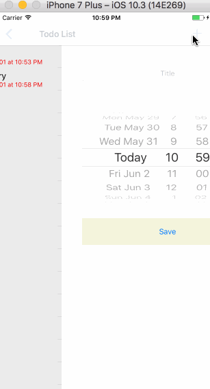

# Reminder
An iOS app which demonstrates local notification

Completed user stories:

Todo List Scene

* [x] User is able to view all the scheduled tasks. 
* [x] Overdue tasks are shown in red, while future tasks are shown in black. 
* [x] User is able to delete a task by swiping and press the "delete" button. 

Schedule Scene

* [x] User is able to specify task name, use date picker for schedule notification time. 
* [x] Press "save" button will save the current schedule task in the disk with unique UUID.

Lock screen

* [x] Local notification will be fired once the task is overdue when in lock screen mode. 

  
  
Walkthrough of all user stories:

GIF created with [LiceCap](http://www.cockos.com/licecap/).
